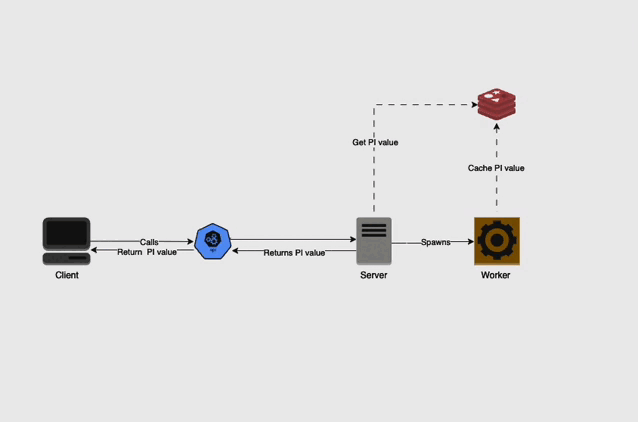
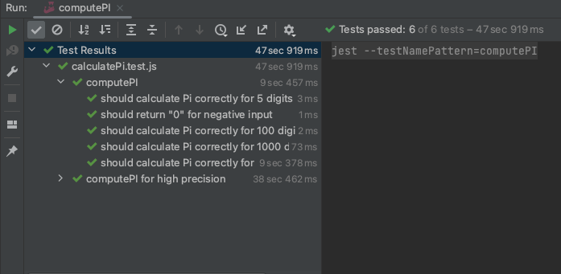

# Life of PI


## Overview

The Life of PI is a Node.js application designed to calculate the value of Pi to an increasing number of decimal places with each request. It utilizes worker threads for asynchronous calculations and Redis for storing the results.

## Architecture Diagram
This architecture efficiently handles Pi calculations and data retrieval by utilizing worker threads for computation and Redis for data storage. The use of asynchronous processing ensures that the application remains responsive, providing a seamless experience for the user.




## Getting Started

### Prerequisites

- Node.js (version 14 or higher), Redis and npm (if running locally without Docker)
- Docker and Docker Compose (for running in a Docker container)

### Environment Variables

To run this project, you will need to add the following environment variables to your `.env` file:

`PORT_NUMBER`

`REDIS_URL`

### Installation

#### Running with Docker

- Clone the repository
- Configure environment variables
- Build Docker image:
```bash
  docker-compose build
```
- Start the application:
```bash
  docker-compose up
```


## API Reference

| Endpoint | Method | Description                                   | Access Level | Input Parameters | Output |
|----------|--------|-----------------------------------------------|--------------|------------------|--------|
| `/pi`    | `POST` | Calculates the next precision of Pi           | Public       | None             | JSON object with the status and the calculated value of Pi |
| `/pi`    | `GET`  | Retrieves the current calculated value of Pi  | Public       | None             | JSON object with the status and the current value of Pi |


## Unit Testing

To run tests, run the following command

```bash
  npm run test
```




## Future Improvements

#### Resource Allocation and Optimization

Conduct a thorough analysis of resource usage during high precision calculations and optimize memory and CPU usage to enhance performance. Consider the use of specialized hardware or cloud-based solutions for performing high precision arithmetic operations.


#### Job Queuing

Implement a job queuing system to manage and prioritize calculation requests, ensuring fair resource distribution and efficient processing.
